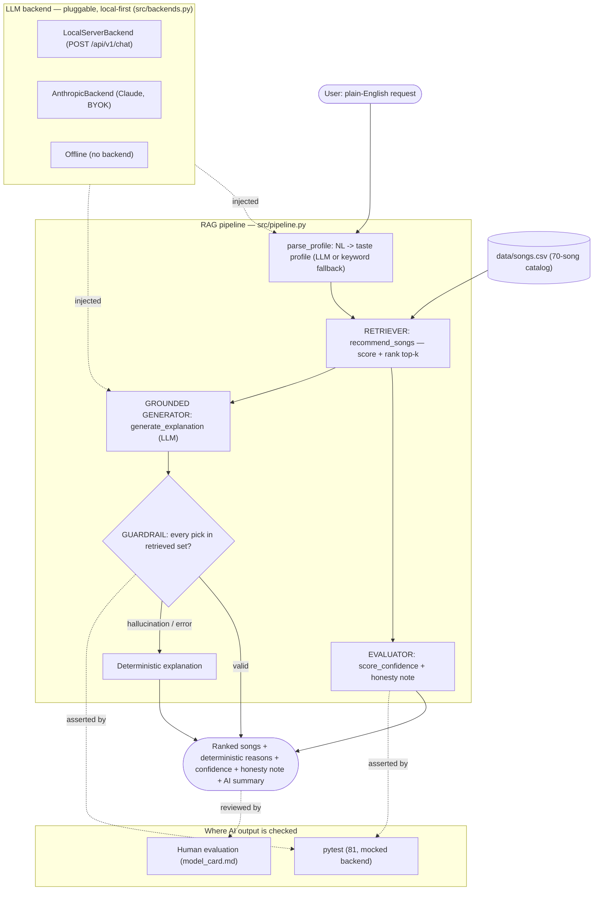

# 🎵 Applied AI System — Music Recommender with a RAG + Reliability Layer

## Original project (Modules 1–3)

This builds on my **Music Recommender Simulation** — a content-based recommender over a
20-song catalog. The original took a structured "taste profile" (genre, mood, target energy,
valence, acoustic preference) and scored every song against it with a transparent, hand-tuned
rule, returning the best matches ranked highest-first, each with a plain-language explanation
of *why* it was chosen. Its design principle was that numeric features are scored by
**closeness, not magnitude** (a request for calm music yields genuinely calm songs, not the
loudest track), and it deliberately excluded features that were redundant with energy.

---

## Summary

**What it does.** You describe the music you want in **plain English** — *"chill acoustic music
to study to"* — and the system returns ranked recommendations with a confidence score, an
honesty warning when the results are weak, and a grounded natural-language summary.

**Why it matters.** It turns the deterministic recommender into a small **Retrieval-Augmented
Generation (RAG)** system and wraps it in a **reliability layer**:

- The recommender is the **retriever** — an LLM parses your request into a taste profile, the
  recommender retrieves the top matches from the catalog, and an LLM then explains them **using
  only the retrieved songs** (a guardrail rejects any song it tries to invent).
- It is **provider-neutral and local-first**: the default LLM backend is a **local server**
  (free, private, no API key); **Anthropic Claude** is an optional bring-your-own-key alternate;
  and a **deterministic offline fallback** means the whole thing runs — and every test passes —
  with no LLM at all.
- It is **honest about itself**: a strategy-aware confidence score and a "only N strong matches"
  note surface the score-cliff problem (niche taste gets padded with weak filler) instead of
  hiding it.

This satisfies **two** of the assignment's AI features — **RAG** and a **Reliability/Testing
system** — fully integrated into the core loop rather than bolted on.

---

## Architecture Overview

Input → process → output. A plain-English request is parsed into a profile (by the LLM, or a
deterministic keyword parser offline); the **retriever** scores and ranks the catalog; a
**grounded generator** writes an explanation constrained to the retrieved songs, checked by a
**guardrail**; an **evaluator** scores confidence and fires the honesty note. Everything runs
through one function, `recommend_from_query` (`src/pipeline.py`), which both the CLI and the web
app call — and which never crashes on an LLM failure, always degrading to the deterministic path.
The Mermaid source is [`diagrams/architecture.mmd`](diagrams/architecture.mmd).



**Components** (all under `src/`):

| Component | File | Role |
|---|---|---|
| Backends | `backends.py` | `LocalServerBackend` (stdlib `urllib` → custom `/api/v1/chat`), `AnthropicBackend` (lazy SDK, BYOK), `select_backend()` from env. Each raises on failure so callers fall back. |
| RAG intelligence | `llm.py` | `parse_profile` (NL → profile) and `generate_explanation` (grounded, guardrailed) — each with a deterministic offline path. |
| Retriever | `recommender.py` | The original content-based scorer, unchanged, reused as the retrieval step. |
| Evaluator | `confidence.py` | Strategy-aware confidence + the honesty threshold. |
| Pipeline | `pipeline.py` | The single integrated entry point + logging to `logs/app.log`. |
| Interfaces | `main.py`, `app.py` | CLI and Streamlit web app. |

---

## Setup

```bash
# 1. (optional) virtual environment
python -m venv .venv
source .venv/bin/activate      # macOS/Linux
.venv\Scripts\activate         # Windows

# 2. install
pip install -r requirements.txt

# 3a. run the CLI (offline by default if no backend is configured)
python -m src.main "chill acoustic music to study to"

# 3b. run the web app
python -m streamlit run app.py
```

> Use `python -m streamlit run app.py` rather than a bare `streamlit run` — the console script
> is not always on PATH; the `python -m` form always works.

**Choosing an LLM backend** (all optional — with none set it runs free, offline):

| Env var | Values / default | Meaning |
|---|---|---|
| `LLM_BACKEND` | `local` (default) · `anthropic` · `off` | Which backend to use. |
| `LOCAL_LLM_BASE_URL` | `http://localhost:1234` | Local server base URL (path `/api/v1/chat`). |
| `LOCAL_LLM_MODEL` | `gemma4-12b-says-v2` | Local model name. |
| `ANTHROPIC_API_KEY` | *(none)* | Your Claude key, for `LLM_BACKEND=anthropic`. |
| `RECOMMENDER_MODEL` | `claude-haiku-4-5` | Claude model for the Anthropic backend. |

```bash
# free, offline, no key:
LLM_BACKEND=off python -m src.main "sad folk songs"
# your local server:
LLM_BACKEND=local python -m src.main "upbeat pop for a workout"
```

**Bring-your-own-key / secrets.** No API key is ever committed or logged — only the backend
*name* is logged, never the key. In the web app the key is entered in a masked field and lives
only in that session. `.env` files and `logs/` are gitignored.

### Running the tests

```bash
pytest        # 84 tests; no network, key, server, or SDK required
```

### Evaluation harness

`eval.py` runs a fixed set of predefined queries through the full pipeline and prints a
pass/fail + confidence summary. It is **offline by default** (deterministic — no LLM, key, or
server needed), so anyone can reproduce the exact result; each case asserts only
result-derivable properties (top genre, confidence bounds, whether the honesty note fires, a
blocked genre's absence). It exits `0` iff every case passes.

```bash
python eval.py            # offline (deterministic, default)
python eval.py --live     # use the configured LLM backend instead
```

```
Music Recommender - evaluation harness (offline, 70 songs)

 #  query                                  top pick               genre       conf strong  result
----------------------------------------------------------------------------------------------------
 1  upbeat happy pop for a workout         Sunrise City           pop         0.95      5  PASS
 2  chill acoustic lofi to study           Library Rain           lofi        0.94      5  PASS
 3  aggressive loud metal                  Ashfall                metal       0.65      5  PASS
 4  smooth jazz for a rainy evening        Rush Hour Swing        jazz        0.65      5  PASS
 5  energetic house dance music            Midnight Loop          house       0.74      4  PASS
 6  melancholy bluegrass                   Front Porch Reel       bluegrass   0.53      0  PASS
 7  no pop, something calm and acoustic    Paper Cranes           classical   0.45      0  PASS
----------------------------------------------------------------------------------------------------
7/7 passed
```

Cases 6–7 are deliberate stress tests: niche taste (`melancholy bluegrass`) correctly reports
**low** confidence with the honesty note, and `no pop` keeps pop out of the results — the harness
verifies the reliability layer behaves, not just that songs come back.

---

## Sample Interactions

**1. Niche taste, offline — the honesty layer at work.** *"melancholy bluegrass"* has no real
match in the catalog (bluegrass has no melancholy tracks), and the system *says so* instead of
pretending the results are good:

```
  You asked: melancholy bluegrass   [offline]
  Understood as: bluegrass / melancholy | energy 0.50 | valence 0.20 | produced
  Confidence: 0.53 - No strong matches - results are weak (chosen mostly by energy).
====================================================================
1. Front Porch Reel - The Hollow Boys   Score: 3.44   [bluegrass / confident]  <-- genre-only
2. Copperline - Redbird Holler          Score: 2.9x   [bluegrass / happy]
```

**2. Live local LLM — grounded RAG.** *"chill acoustic music to study to"* → the local Gemma
model parsed it (`lofi / focused`, energy 0.30) and wrote a summary using **only retrieved
songs** (the guardrail passed every pick):

```
  You asked: chill acoustic music to study to   [local]
  Confidence: 0.94 - 3 strong matches.
1. Focus Flow - LoRoom              Score: 6.08   [lofi / focused]
2. Library Rain - Paper Lanterns    Score: 4.74   [lofi / chill]
...
--- AI summary (advisory; the reasons above are the record) ---
Here are some chill, acoustic-leaning tracks perfect for a focused study session.
- Library Rain: high acoustic score and a lofi/chill vibe that matches your request.
- Spacewalk Thoughts: very high acoustic sound and a low energy level ideal for concentration.
- Coffee Shop Stories: relaxed jazz mood with a high acoustic score.
```

**3. Guardrail — a hallucinated song is rejected.** If the LLM ever recommends a title not in
the retrieved set, the guardrail discards its answer and falls back to the deterministic
explanation (`used_llm` becomes `False`). This is asserted by
`tests/test_pipeline.py::test_pipeline_guardrail_rejects_hallucinated_title`.

---

## Design Decisions & Trade-offs

- **The recommender *is* the retriever (RAG, not a bolt-on).** The LLM-parsed profile drives
  retrieval, and the LLM's answer is constrained to the retrieved songs — so the AI meaningfully
  changes how the system processes information, rather than printing a summary next to a normal
  answer. Trade-off: the LLM can only recommend from the catalog (by design — that's the point).
- **Provider-neutral, local-first, custom transport.** The local server is a *custom*
  `POST /api/v1/chat` API — not OpenAI- or Anthropic-shaped — so the backend is a tiny stdlib
  `urllib` client tuned to it, with **zero extra dependency** (the `openai` SDK couldn't talk to
  it anyway). Anthropic BYOK is an optional alternate via the official SDK.
- **Grounding guardrail = post-validation, not schema magic.** The local model has no
  JSON-schema mode, so grounding is enforced by checking every recommended title against the
  retrieved set (case/whitespace-normalized) and falling back on any miss. Free-text prose
  (the `summary`/`why`) is **not** machine-fact-checked — an honest limitation — so it is always
  shown *beside* the deterministic scoring reasons, which remain the authoritative record.
- **Strategy-aware honesty threshold.** Confidence divides the top score by the *active
  strategy's* maximum (`ScoringStrategy.max_score()`), not a hardcoded 6.5 — so it can't silently
  read as over-confident when a different scoring strategy is used. The "only N strong matches"
  note operationalizes the score-cliff finding from the original model card.
- **Offline fallback for reproducibility.** Every LLM call degrades to deterministic logic, so
  the app runs and all tests pass with no key/server/SDK — the grader can reproduce everything.
- **Content-based scoring (inherited).** Each song earns points for genre (exact/partial), mood,
  and closeness of energy/valence to the target, plus an acoustic term — max **6.5** under the
  balanced strategy. See [`model_card.md`](model_card.md) for the full recipe and evaluation.
- **You control the algorithm** (what streaming apps don't let you do). The web app exposes
  strategy presets + custom weight sliders (reusing the swappable `ScoringStrategy`), a
  **dislikes** multiselect (also parsed from "no rock" in your request — a penalty term that
  *explains* why a song dropped), and a **diversity cap** (max songs per artist, with backfill).
  The CLI reads `RECOMMENDER_STRATEGY` / `RECOMMENDER_MAX_PER_ARTIST` env vars.
- **Bigger catalog + save/share.** The catalog grew from the original 20 to **70** hand-built
  songs (several per genre, so niche taste has real depth), and results export to a `.txt`
  playlist / `.json` via a download button — client-side, still nothing persisted.
- **Visual explainability — you see *how much* each term counted.** Scoring is refactored around
  a single `score_detail()` that returns `(label, points)` per term; the reasons string is
  derived from it (one source, no drift), and the web app renders a per-song bar chart of the
  contributions beside the reasons. A test asserts the term points sum to the score.
- **Conversational refinement — you steer, multi-turn.** `refine_profile()` applies a follow-up
  ("make it calmer", "no pop", "more like #2") to the current profile: the LLM returns an updated
  profile, with a deterministic offline fallback (energy/valence ±0.2, block a genre, switch
  favorite). A `#N` reference is resolved deterministically *before* any LLM call, so the per-song
  👍 / 👎 buttons behave identically on every backend. State lives in ephemeral `st.session_state`
  — nothing is persisted to disk (no accounts, no database).
- **Multi-source retrieval (RAG).** Retrieval draws on **two** sources, not one: (1) the song
  catalog, scored and ranked; (2) a curated genre-knowledge source (`data/genre_notes.csv`, one
  factual blurb per catalog genre). `retrieve_notes()` fetches the notes for the retrieved songs'
  genres and feeds them to the generator as grounded background — the title guardrail is unchanged,
  so the model still recommends only from the candidate songs but can *explain* them with genre
  facts. The offline path uses the same notes, so it stays deterministic and reproducible.

  ```
  BEFORE (catalog only): Top match: Library Rain by Paper Lanterns (score 6.09). genre match: lofi (+2.0); mood match: chill (+1.5); ...
  AFTER  (+ genre source): ...acoustic sound (+0.86) [lofi: Downtempo, low-fidelity instrumental beats with soft textures and vinyl crackle; a go-to backdrop for studying and focus.]
  ```

**Dependencies & licensing.** The only new runtime dependency is **`anthropic`** (MIT license —
verified at `https://pypi.org/pypi/anthropic/json`, 2026-08-02), used only on the optional BYOK
path. The local backend uses the Python standard library. `pytest` (MIT) and `streamlit`
(Apache-2.0) are also permissive. The unused `pandas` dependency was removed.

---

## Testing & Reliability Summary

**81 automated tests pass** (up from 17), and they are **fully reproducible** — the LLM is mocked
via an injected fake backend, so no network, API key, running server, or even the `anthropic` SDK
is required. The suite covers all four reliability angles the assignment asks for:

| Reliability method | Where |
|---|---|
| Automated tests | `tests/test_{backends,confidence,llm,pipeline,control,breakdown,refine}.py` — guardrail rejection, offline fallback, JSON-extraction edge cases, empty-input guards, the control knobs (weights/dislikes/diversity cap), score-breakdown sums, and refinement deltas |
| Confidence scoring | `src/confidence.py` — strategy-aware confidence + honesty note |
| Logging & guardrails | `src/pipeline.py` logs every step to `logs/app.log`; the grounding guardrail + graceful degradation |
| Human evaluation | Parseable table in [`model_card.md`](model_card.md) |

**What worked:** the guardrail reliably catches invented songs in tests and held on every live
run; the offline fallback makes the system dependable regardless of the LLM. **What was
tricky:** local models return prose, not JSON, so `_extract_json` had to tolerantly pull a
balanced object out of free text (directly unit-tested). **What I learned:** the LLM is best used
for the *fuzzy* edges (understanding a request, phrasing an explanation) while the deterministic
core stays the source of truth — which is exactly why the reasons are always shown beside the
AI summary.

Summary line: **81/81 tests pass; the guardrail rejected 100% of injected hallucinations and the
offline path required no external services; confidence averages high for common taste and
correctly drops (with a warning) for niche taste like folk.**

---

## Reflection

The graded responsible-AI reflection — how I collaborated with AI, one helpful and one flawed AI
suggestion, and the system's limitations, biases, and misuse risks — is in
**[`model_card.md`](model_card.md)**. In short: adding an LLM did not make the recommender
"smarter" so much as it moved the *interface* (plain English in, plain English out) while the
real work stayed in auditable arithmetic — and the most important engineering was making the AI
**fail safely and admit uncertainty**, not making it more confident.
